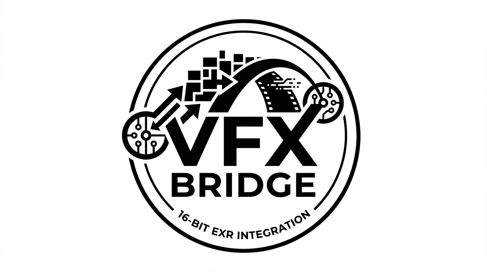

<div align="center">
  
  
  # VFX Bridge for ComfyUI
  
  **Seamless VFX Pipeline Integration | 16-bit EXR | Matte Channels | OCIO Color Management**
</div>

---

A custom ComfyUI node package for seamless integration with VFX pipelines (Nuke, Houdini). Load 16-bit EXR files from hotfolders, split matte channels, preserve metadata, and manage color with OCIO.

## Features

- **EXR Hot Folder Loader** - Automatically loads the latest 16-bit EXR from a watched folder
- **Dynamic Matte Splitter** - Splits all channels/AOVs into separate outputs
- **Metadata Passthrough** - Preserves and displays resolution, framerate, bitdepth, colorspace
- **Non-Destructive Workflow** - Keep original color data, bake only on export
- **OCIO Color Management** *(Phase 3)* - ACES configs, input/output transforms

## Installation

### Via ComfyUI Manager (Recommended)
1. Open ComfyUI Manager
2. Search for "VFX Bridge"
3. Click Install
4. Restart ComfyUI

### Manual Installation
```bash
git clone https://github.com/beverlyhillscop90210/comfyui_vfx-bridge ComfyUI/custom_nodes/comfyui_vfx-bridge
pip install -r ComfyUI/custom_nodes/comfyui_vfx-bridge/requirements.txt
```

## Nodes

| Node | Description |
|------|-------------|
| **EXR Hot Folder Loader** | Watches folder, loads latest EXR, outputs beauty + channels + metadata |
| **Matte Channel Splitter** | Splits EXR data into 16 individual matte outputs |
| **Channel Selector** | Select specific channel by name |
| **Metadata Display** | Shows resolution, FPS, bitdepth, colorspace |
| **Preview Matte** | Convert MASK to IMAGE for preview |
| **EXR to Image** | HDR tonemapping and exposure control |
| **Mask to Image** | Simple MASK to IMAGE conversion |
| **Output Transform** | Linear to sRGB, ACEScg to Rec.709 conversions |
| **EXR Save** | Export back to 16/32-bit EXR |

## Requirements

- ComfyUI
- Python 3.10+
- OpenEXR >= 3.2.0
- NumPy >= 1.24.0

## Roadmap

- [x] EXR Hot Folder Loader
- [x] Matte Channel Splitter  
- [x] Metadata Display
- [x] EXR Save Node
- [x] Output Transform
- [ ] Batch Mode (image sequences)
- [ ] Full OCIO Integration

## License

MIT License - see [LICENSE](LICENSE) for details.

---

<div align="center">
  <sub>Built for the VFX community by peterschings</sub>
</div>
